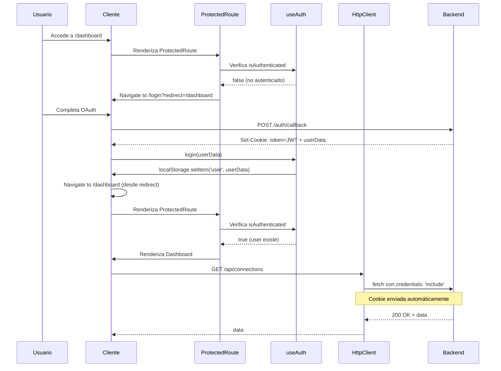
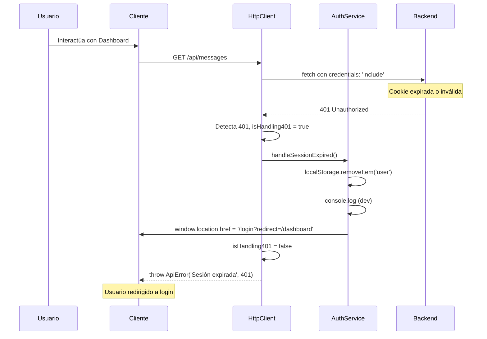
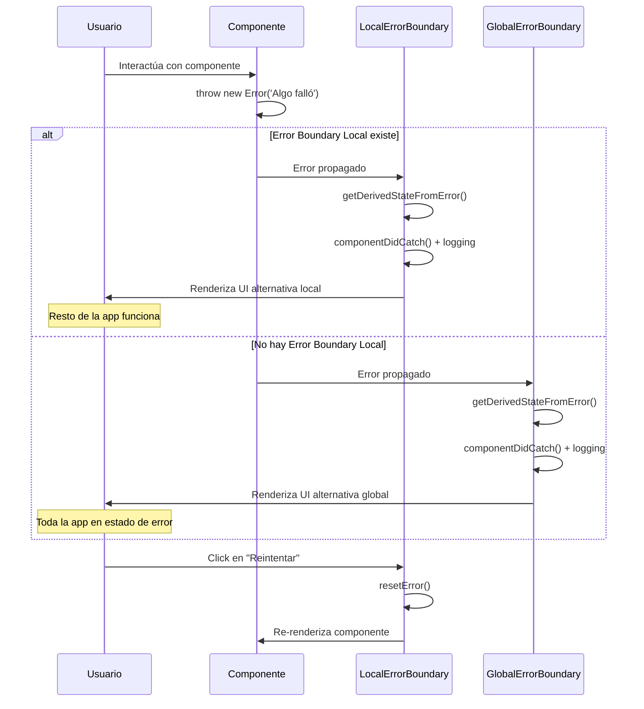

# Documento de Diseño: Robustez y Seguridad del Cliente

## Resumen

Este diseño implementa tres mejoras críticas de seguridad y robustez para el cliente Streamlyra:

1. **Sistema de Rutas Protegidas**: Componente ProtectedRoute que valida autenticación antes de renderizar rutas sensibles
2. **Sistema de Barreras de Errores**: Error Boundaries globales y locales para aislar fallos de componentes
3. **Migración a HttpOnly Cookies**: Eliminación de tokens JWT de localStorage para prevenir ataques XSS

La arquitectura actual utiliza React Router v6, un hook `useAuth` personalizado con localStorage, y un `HttpClient` que envuelve fetch. El diseño mantiene compatibilidad con el flujo OAuth existente mientras refuerza significativamente la seguridad.

## Arquitectura

### Arquitectura Actual

```
┌─────────────────────────────────────────────────────────┐
│                        main.tsx                          │
│                     (StrictMode)                         │
└────────────────────┬────────────────────────────────────┘
                     │
                     ▼
┌─────────────────────────────────────────────────────────┐
│                        App.tsx                           │
│                   (BrowserRouter)                        │
│                                                          │
│  Routes (todas públicas):                               │
│    / → Landing                                          │
│    /login, /register, /connect → PlatformConnection    │
│    /dashboard → Dashboard (sin protección)              │
│    /auth/callback → AuthCallback                        │
└────────────────────┬────────────────────────────────────┘
                     │
                     ▼
┌─────────────────────────────────────────────────────────┐
│                   useAuth Hook                           │
│                                                          │
│  - user: User | null (localStorage)                     │
│  - token: string | null (localStorage)                  │
│  - isAuthenticated: boolean                             │
│  - login(token, user)                                   │
│  - logout()                                             │
│  - requireAuth()                                        │
└────────────────────┬────────────────────────────────────┘
                     │
                     ▼
┌─────────────────────────────────────────────────────────┐
│                   HttpClient                             │
│                                                          │
│  - getAuthToken() → lee de localStorage                 │
│  - request() → añade Bearer token si requiresAuth       │
│  - Sin interceptor para 401                             │
│  - Sin credentials: 'include'                           │
└─────────────────────────────────────────────────────────┘
```

### Arquitectura Propuesta

```
┌─────────────────────────────────────────────────────────┐
│                        main.tsx                          │
│                     (StrictMode)                         │
└────────────────────┬────────────────────────────────────┘
                     │
                     ▼
┌─────────────────────────────────────────────────────────┐
│              GlobalErrorBoundary                         │
│         (captura errores de toda la app)                │
└────────────────────┬────────────────────────────────────┘
                     │
                     ▼
┌─────────────────────────────────────────────────────────┐
│                        App.tsx                           │
│                   (BrowserRouter)                        │
│                                                          │
│  Routes:                                                │
│    / → Landing (pública)                                │
│    /login, /register → PlatformConnection (pública)     │
│    /auth/callback → AuthCallback (pública)              │
│    /dashboard → ProtectedRoute(Dashboard)               │
│    /connect → ProtectedRoute(PlatformConnection)        │
└────────────────────┬────────────────────────────────────┘
                     │
                     ▼
┌─────────────────────────────────────────────────────────┐
│                  ProtectedRoute                          │
│                                                          │
│  1. Verifica isAuthenticated                            │
│  2. Si no auth → Navigate to /login?redirect=...        │
│  3. Si auth → renderiza children                        │
└────────────────────┬────────────────────────────────────┘
                     │
                     ▼
┌─────────────────────────────────────────────────────────┐
│            Dashboard / PlatformConnection                │
│                                                          │
│  Envueltos en LocalErrorBoundary                        │
│  (aisla errores de secciones críticas)                  │
└────────────────────┬────────────────────────────────────┘
                     │
                     ▼
┌─────────────────────────────────────────────────────────┐
│                   useAuth Hook                           │
│                                                          │
│  - user: User | null (localStorage - solo perfil)       │
│  - isAuthenticated: boolean (estado de sesión)          │
│  - checkAuth() → llama /auth/me al iniciar              │
│  - login(user) → guarda perfil, NO token                │
│  - logout() → limpia estado y localStorage              │
│  - NO maneja tokens directamente                        │
└────────────────────┬────────────────────────────────────┘
                     │
                     ▼
┌─────────────────────────────────────────────────────────┐
│                   HttpClient                             │
│                                                          │
│  - credentials: 'include' en todas las peticiones       │
│  - NO lee tokens de localStorage                        │
│  - Interceptor 401 → llama authService.handleExpired()  │
│  - Cookies HttpOnly enviadas automáticamente            │
└─────────────────────────────────────────────────────────┘
```

### Flujo de Autenticación Mejorado

```
Usuario → Login OAuth → Backend
                          │
                          ▼
                    Set-Cookie: token=JWT; HttpOnly; Secure
                          │
                          ▼
Cliente ← Respuesta con user data
    │
    ▼
useAuth.login(userData)
    │
    ▼
localStorage.setItem('user', userData)  // Solo perfil, NO token
    │
    ▼
Navigate to /dashboard
    │
    ▼
ProtectedRoute verifica isAuthenticated
    │
    ▼
HttpClient hace peticiones con credentials: 'include'
    │
    ▼
Cookie enviada automáticamente en cada request
```

### Flujo de Manejo de Errores

```
Componente lanza error
    │
    ▼
¿Error Boundary local existe?
    │
    ├─ Sí → LocalErrorBoundary captura
    │         │
    │         ▼
    │    Muestra UI alternativa local
    │    (resto de la app funciona)
    │
    └─ No → GlobalErrorBoundary captura
              │
              ▼
         Muestra UI alternativa global
         (toda la app en estado de error)
```

## Componentes e Interfaces

### 1. ProtectedRoute Component

**Propósito**: Validar autenticación antes de renderizar rutas protegidas.

**Interfaz**:

```typescript
interface ProtectedRouteProps {
  children: React.ReactNode;
  redirectTo?: string;
}

function ProtectedRoute({ 
  children, 
  redirectTo = '/login' 
}: ProtectedRouteProps): JSX.Element
```

**Implementación**:

```typescript
import { Navigate, useLocation } from 'react-router-dom';
import { useAuth } from '../hooks/useAuth';

export function ProtectedRoute({ 
  children, 
  redirectTo = '/login' 
}: ProtectedRouteProps) {
  const { isAuthenticated } = useAuth();
  const location = useLocation();

  if (!isAuthenticated) {
    // Preservar URL destino para redirección post-login
    return (
      <Navigate 
        to={`${redirectTo}?redirect=${encodeURIComponent(location.pathname)}`} 
        replace 
      />
    );
  }

  return <>{children}</>;
}
```

**Uso en App.tsx**:

```typescript
<Routes>
  <Route path="/" element={<Landing />} />
  <Route path="/login" element={<PlatformConnection />} />
  <Route path="/register" element={<PlatformConnection />} />
  <Route path="/auth/callback" element={<AuthCallback />} />
  
  <Route 
    path="/dashboard" 
    element={
      <ProtectedRoute>
        <Dashboard />
      </ProtectedRoute>
    } 
  />
  
  <Route 
    path="/connect" 
    element={
      <ProtectedRoute>
        <PlatformConnection />
      </ProtectedRoute>
    } 
  />
  
  <Route path="*" element={<Navigate to="/" replace />} />
</Routes>
```

### 2. Error Boundary System

**Propósito**: Capturar errores de componentes y prevenir colapso de la aplicación.

#### GlobalErrorBoundary

**Interfaz**:

```typescript
interface ErrorBoundaryProps {
  children: React.ReactNode;
  fallback?: React.ComponentType<ErrorFallbackProps>;
}

interface ErrorBoundaryState {
  hasError: boolean;
  error: Error | null;
  errorInfo: React.ErrorInfo | null;
}

interface ErrorFallbackProps {
  error: Error;
  errorInfo: React.ErrorInfo;
  resetError: () => void;
}
```

**Implementación**:

```typescript
import React from 'react';

export class GlobalErrorBoundary extends React.Component<
  ErrorBoundaryProps,
  ErrorBoundaryState
> {
  constructor(props: ErrorBoundaryProps) {
    super(props);
    this.state = {
      hasError: false,
      error: null,
      errorInfo: null,
    };
  }

  static getDerivedStateFromError(error: Error): Partial<ErrorBoundaryState> {
    return { hasError: true, error };
  }

  componentDidCatch(error: Error, errorInfo: React.ErrorInfo) {
    // Logging en desarrollo
    if (import.meta.env.DEV) {
      console.error('GlobalErrorBoundary caught error:', {
        error,
        errorInfo,
        componentStack: errorInfo.componentStack,
        timestamp: new Date().toISOString(),
      });
    }

    // TODO: Integrar con servicio de logging externo en producción
    // logErrorToService(error, errorInfo);

    this.setState({ errorInfo });
  }

  resetError = () => {
    this.setState({
      hasError: false,
      error: null,
      errorInfo: null,
    });
  };

  render() {
    if (this.state.hasError && this.state.error) {
      const FallbackComponent = this.props.fallback || GlobalErrorFallback;
      
      return (
        <FallbackComponent
          error={this.state.error}
          errorInfo={this.state.errorInfo!}
          resetError={this.resetError}
        />
      );
    }

    return this.props.children;
  }
}
```

#### GlobalErrorFallback Component

```typescript
function GlobalErrorFallback({ error, resetError }: ErrorFallbackProps) {
  return (
    <div className="min-h-screen flex items-center justify-center bg-gray-50 px-4">
      <div className="max-w-md w-full bg-white rounded-lg shadow-lg p-6">
        <div className="flex items-center justify-center w-12 h-12 mx-auto bg-red-100 rounded-full">
          <svg className="w-6 h-6 text-red-600" fill="none" viewBox="0 0 24 24" stroke="currentColor">
            <path strokeLinecap="round" strokeLinejoin="round" strokeWidth={2} d="M6 18L18 6M6 6l12 12" />
          </svg>
        </div>
        
        <h2 className="mt-4 text-xl font-semibold text-center text-gray-900">
          Algo salió mal
        </h2>
        
        <p className="mt-2 text-sm text-center text-gray-600">
          La aplicación encontró un error inesperado. Por favor, intenta recargar la página.
        </p>
        
        {import.meta.env.DEV && (
          <details className="mt-4 p-3 bg-gray-100 rounded text-xs">
            <summary className="cursor-pointer font-medium text-gray-700">
              Detalles técnicos (solo en desarrollo)
            </summary>
            <pre className="mt-2 whitespace-pre-wrap text-red-600">
              {error.message}
            </pre>
          </details>
        )}
        
        <button
          onClick={resetError}
          className="mt-6 w-full px-4 py-2 bg-blue-600 text-white rounded-lg hover:bg-blue-700 transition-colors"
        >
          Intentar de nuevo
        </button>
      </div>
    </div>
  );
}
```

#### LocalErrorBoundary

**Propósito**: Aislar errores a secciones específicas de la aplicación.

```typescript
export class LocalErrorBoundary extends React.Component<
  ErrorBoundaryProps,
  ErrorBoundaryState
> {
  // Implementación similar a GlobalErrorBoundary
  // pero con UI alternativa más compacta
  
  render() {
    if (this.state.hasError && this.state.error) {
      return (
        <div className="p-4 bg-red-50 border border-red-200 rounded-lg">
          <h3 className="text-sm font-medium text-red-800">
            Error en esta sección
          </h3>
          <p className="mt-1 text-xs text-red-600">
            No pudimos cargar este contenido. El resto de la aplicación sigue funcionando.
          </p>
          <button
            onClick={this.resetError}
            className="mt-2 text-xs text-red-700 underline hover:text-red-900"
          >
            Reintentar
          </button>
        </div>
      );
    }

    return this.props.children;
  }
}
```

**Uso en componentes críticos**:

```typescript
// En Dashboard.tsx
function Dashboard() {
  return (
    <div className="dashboard">
      <LocalErrorBoundary>
        <ChatFeed />
      </LocalErrorBoundary>
      
      <LocalErrorBoundary>
        <ConnectionsPanel />
      </LocalErrorBoundary>
    </div>
  );
}
```

### 3. HttpOnly Cookie Authentication

#### Modificaciones a HttpClient

**Cambios principales**:
1. Añadir `credentials: 'include'` a todas las peticiones
2. Eliminar lectura de tokens de localStorage
3. Implementar interceptor para errores 401
4. Integrar con authService para manejo de sesión expirada

**Implementación actualizada**:

```typescript
import { env } from '../config/env';
import { authService } from '../services/auth';

export class ApiError extends Error {
  constructor(
    message: string,
    public status: number,
    public data?: unknown
  ) {
    super(message);
    this.name = 'ApiError';
  }
}

interface RequestOptions extends RequestInit {
  skipAuthCheck?: boolean; // Para endpoints públicos
}

class HttpClient {
  private baseUrl: string;
  private isHandling401 = false; // Prevenir múltiples limpiezas simultáneas

  constructor(baseUrl: string) {
    this.baseUrl = baseUrl;
  }

  private async request<T>(
    endpoint: string,
    options: RequestOptions = {}
  ): Promise<T> {
    const { skipAuthCheck = false, headers = {}, ...fetchOptions } = options;

    const requestHeaders: Record<string, string> = {
      'Content-Type': 'application/json',
      ...(headers as Record<string, string>),
    };

    const url = `${this.baseUrl}${endpoint}`;

    try {
      const response = await fetch(url, {
        ...fetchOptions,
        headers: requestHeaders,
        credentials: 'include', // Envía cookies HttpOnly automáticamente
      });

      // Interceptor 401: Sesión expirada
      if (response.status === 401 && !skipAuthCheck && !this.isHandling401) {
        this.isHandling401 = true;
        
        // Logging para debugging
        if (import.meta.env.DEV) {
          console.warn('401 Unauthorized - Sesión expirada', {
            endpoint,
            timestamp: new Date().toISOString(),
          });
        }

        // Delegar manejo de sesión expirada a authService
        await authService.handleSessionExpired();
        
        this.isHandling401 = false;
        
        // Lanzar error para que el componente pueda manejarlo
        throw new ApiError('Sesión expirada', 401);
      }

      if (!response.ok) {
        const errorData = await response.json().catch(() => ({})) as { error?: string };
        throw new ApiError(
          errorData.error ?? `HTTP ${response.status}`,
          response.status,
          errorData
        );
      }

      return await response.json();
    } catch (error) {
      if (error instanceof ApiError) {
        throw error;
      }
      throw new ApiError('Network error', 0, error);
    }
  }

  async get<T>(endpoint: string, skipAuthCheck = false): Promise<T> {
    return this.request<T>(endpoint, { method: 'GET', skipAuthCheck });
  }

  async post<T>(
    endpoint: string,
    data?: unknown,
    skipAuthCheck = false
  ): Promise<T> {
    return this.request<T>(endpoint, {
      method: 'POST',
      body: JSON.stringify(data),
      skipAuthCheck,
    });
  }

  async delete<T>(
    endpoint: string, 
    data?: unknown, 
    skipAuthCheck = false
  ): Promise<T> {
    return this.request<T>(endpoint, {
      method: 'DELETE',
      body: data ? JSON.stringify(data) : undefined,
      skipAuthCheck,
    });
  }
}

export const apiClient = new HttpClient(env.apiUrl);
```

#### AuthService

**Propósito**: Centralizar lógica de manejo de sesión expirada.

```typescript
// src/services/auth.ts

class AuthService {
  handleSessionExpired(): void {
    // Limpiar estado de usuario de localStorage
    localStorage.removeItem('user');
    
    // Logging
    if (import.meta.env.DEV) {
      console.log('Sesión limpiada - redirigiendo a login');
    }

    // Preservar URL actual para redirección post-login
    const currentPath = window.location.pathname;
    const redirectParam = currentPath !== '/' && currentPath !== '/login' 
      ? `?redirect=${encodeURIComponent(currentPath)}`
      : '';

    // Redirigir a login
    window.location.href = `/login${redirectParam}`;
  }
}

export const authService = new AuthService();
```

#### Modificaciones a useAuth Hook

**Cambios principales**:
1. Eliminar gestión de tokens
2. Añadir método `checkAuth()` para verificar sesión al iniciar
3. Simplificar `login()` para solo guardar perfil de usuario

```typescript
import { useState, useEffect } from 'react';
import { useNavigate } from 'react-router-dom';
import { useLocalStorage } from './useLocalStorage';
import { apiClient } from '../api/client';
import type { User } from '../types';

export const useAuth = () => {
  const navigate = useNavigate();
  const [user, setUser, removeUser] = useLocalStorage<User | null>('user', null);
  const [isChecking, setIsChecking] = useState(true);

  const isAuthenticated = !!user;

  // Verificar sesión al iniciar la aplicación
  const checkAuth = async () => {
    try {
      // Llamar endpoint que verifica cookie HttpOnly
      const userData = await apiClient.get<User>('/auth/me', true);
      setUser(userData);
    } catch (error) {
      // Si falla, limpiar cualquier dato residual
      removeUser();
    } finally {
      setIsChecking(false);
    }
  };

  useEffect(() => {
    checkAuth();
  }, []);

  const login = (userData: User) => {
    // Solo guardar perfil de usuario, NO token
    setUser(userData);
  };

  const logout = async () => {
    try {
      // Llamar endpoint de logout para limpiar cookie en backend
      await apiClient.post('/auth/logout', {}, true);
    } catch (error) {
      console.error('Error during logout:', error);
    } finally {
      // Limpiar estado local
      removeUser();
      navigate('/');
    }
  };

  const requireAuth = () => {
    if (!isAuthenticated) {
      navigate('/login');
      return false;
    }
    return true;
  };

  return {
    user,
    isAuthenticated,
    isChecking,
    login,
    logout,
    requireAuth,
    checkAuth,
  };
};
```

## Modelos de Datos

### User (sin cambios)

```typescript
interface User {
  id: string;
  email: string;
  username: string;
  avatar?: string;
  createdAt: string;
}
```

### ErrorLog (nuevo)

```typescript
interface ErrorLog {
  timestamp: string;
  error: {
    message: string;
    stack?: string;
  };
  componentStack?: string;
  userContext?: {
    userId?: string;
    path: string;
    userAgent: string;
  };
  environment: 'development' | 'production';
}
```

### AuthState (modificado)

```typescript
interface AuthState {
  user: User | null;
  isAuthenticated: boolean;
  isChecking: boolean;
}

// ELIMINADO: token ya no se gestiona en el cliente
```

## Propiedades de Corrección


Una propiedad es una característica o comportamiento que debe mantenerse verdadero en todas las ejecuciones válidas de un sistema - esencialmente, una declaración formal sobre lo que el sistema debe hacer. Las propiedades sirven como puente entre especificaciones legibles por humanos y garantías de corrección verificables por máquinas.

### Propiedades de Rutas Protegidas

**Propiedad 1: Validación de autenticación antes de renderizado**

*Para cualquier* ruta protegida y cualquier estado de autenticación, el componente ProtectedRoute solo debe renderizar el contenido hijo cuando el usuario está autenticado.

**Valida: Requisitos 1.1**

**Propiedad 2: Redirección de usuarios no autenticados**

*Para cualquier* ruta protegida, cuando un usuario no autenticado intenta acceder, el sistema debe redirigir a /login.

**Valida: Requisitos 1.2**

**Propiedad 3: Preservación de URL destino en redirección**

*Para cualquier* URL de destino protegida, cuando se redirige a login, la URL original debe preservarse en el parámetro de query `redirect`.

**Valida: Requisitos 1.3**

**Propiedad 4: Redirección post-autenticación**

*Para cualquier* URL preservada en el parámetro redirect, después de autenticación exitosa, el sistema debe redirigir a esa URL original.

**Valida: Requisitos 1.4**

**Propiedad 5: Prevención de acceso a páginas de auth cuando autenticado**

*Para cualquier* usuario autenticado, intentar acceder a /login o /register debe resultar en redirección a /dashboard.

**Valida: Requisitos 1.7**

### Propiedades de Error Boundaries

**Propiedad 6: Captura de errores de componentes**

*Para cualquier* error lanzado por un componente hijo, el Error Boundary debe capturarlo y prevenir que la aplicación colapse.

**Valida: Requisitos 2.2**

**Propiedad 7: Renderizado de UI alternativa al capturar error**

*Para cualquier* error capturado por un Error Boundary, el sistema debe renderizar una UI alternativa en lugar del componente fallido.

**Valida: Requisitos 2.3**

**Propiedad 8: UI alternativa contiene botón de recarga**

*Para cualquier* UI alternativa renderizada, debe contener un botón que permita reintentar la carga del componente.

**Valida: Requisitos 2.4**

**Propiedad 9: Logging de errores en desarrollo**

*Para cualquier* error capturado en entorno de desarrollo, el sistema debe registrar el error completo (mensaje, stack trace, component stack) en consola.

**Valida: Requisitos 2.5, 6.1, 6.2**

**Propiedad 10: Aislamiento de errores locales**

*Para cualquier* Error Boundary local que captura un error, el fallo debe aislarse solo a esa sección sin afectar otros componentes de la aplicación.

**Valida: Requisitos 2.7**

**Propiedad 11: Preservación de estado fuera del árbol fallido**

*Para cualquier* error capturado por un Error Boundary, el estado de la aplicación fuera del árbol de componentes fallido debe preservarse sin cambios.

**Valida: Requisitos 2.8**

### Propiedades de Autenticación con HttpOnly Cookies

**Propiedad 12: Inclusión de credentials en peticiones HTTP**

*Para todas* las peticiones HTTP realizadas por HttpClient, deben incluir la opción `credentials: 'include'` para enviar cookies automáticamente.

**Valida: Requisitos 3.2**

**Propiedad 13: Almacenamiento de perfil sin token**

*Para cualquier* autenticación exitosa, el perfil de usuario debe guardarse en localStorage pero el token JWT no debe estar accesible desde JavaScript del cliente.

**Valida: Requisitos 3.4**

**Propiedad 14: Limpieza de sesión en respuesta 401**

*Para cualquier* petición HTTP que recibe respuesta 401, el interceptor debe limpiar automáticamente la sesión del usuario (localStorage y estado en memoria).

**Valida: Requisitos 3.5, 4.2**

**Propiedad 15: Redirección a login tras 401**

*Para cualquier* respuesta 401 que activa limpieza de sesión, el sistema debe redirigir a /login preservando la URL actual en el parámetro redirect.

**Valida: Requisitos 3.6, 4.3**

**Propiedad 16: Validación de autenticación basada en estado de usuario**

*Para cualquier* verificación de autenticación, el hook useAuth debe determinar isAuthenticated basándose en la existencia del objeto user, no en la lectura directa de tokens.

**Valida: Requisitos 3.7**

**Propiedad 17: Idempotencia de limpieza de sesión**

*Para cualquier* conjunto de peticiones simultáneas que reciben 401, el sistema debe ejecutar la limpieza de sesión exactamente una vez.

**Valida: Requisitos 4.5**

### Propiedades de Compatibilidad

**Propiedad 18: Preservación de API pública de useAuth**

*Para cualquier* componente que usa useAuth, los métodos públicos del hook (login, logout, requireAuth, isAuthenticated) deben seguir disponibles con la misma firma.

**Valida: Requisitos 5.3**

**Propiedad 19: Preservación de estructura de datos de usuario**

*Para cualquier* objeto User almacenado en localStorage, la estructura de datos debe mantener los mismos campos que la versión anterior (id, email, username, avatar, createdAt).

**Valida: Requisitos 5.4**

### Propiedades de Logging y UX

**Propiedad 20: Logging completo de errores con contexto**

*Para cualquier* error capturado, el log debe incluir timestamp, stack trace, component stack y contexto de usuario (si está disponible).

**Valida: Requisitos 6.5**

**Propiedad 21: Logging de eventos 401**

*Para cualquier* respuesta 401 que activa limpieza de sesión, el sistema debe registrar el evento con timestamp y endpoint afectado.

**Valida: Requisitos 6.6**

**Propiedad 22: Mensajes de error amigables sin detalles técnicos**

*Para cualquier* UI alternativa mostrada en producción, el mensaje debe ser amigable para el usuario y no debe exponer stack traces o detalles técnicos del error.

**Valida: Requisitos 7.1, 7.2**

**Propiedad 23: Funcionalidad de recuperación de errores**

*Para cualquier* UI alternativa con botón de recarga, hacer clic en el botón debe resetear el estado del Error Boundary e intentar renderizar el componente nuevamente.

**Valida: Requisitos 7.4**

## Manejo de Errores

### Estrategia de Manejo de Errores

El sistema implementa una estrategia de defensa en profundidad con múltiples capas:

1. **Error Boundaries**: Captura errores de renderizado de React
2. **Try-Catch en operaciones asíncronas**: Manejo explícito en llamadas API
3. **Interceptor 401**: Manejo automático de sesión expirada
4. **Logging estructurado**: Registro de errores para debugging

### Tipos de Errores y Respuestas

| Tipo de Error | Capa de Manejo | Respuesta |
|---------------|----------------|-----------|
| Error de renderizado de componente | Error Boundary (local o global) | UI alternativa con opción de recarga |
| Error de red (fetch falla) | HttpClient try-catch | ApiError lanzado, manejado por componente |
| 401 Unauthorized | Interceptor en HttpClient | Limpieza automática de sesión + redirección |
| 4xx/5xx otros | HttpClient | ApiError lanzado con detalles |
| Error de JavaScript no capturado | GlobalErrorBoundary | UI alternativa global |

### Flujo de Manejo de Error 401

```
API Request → 401 Response
    │
    ▼
HttpClient detecta 401
    │
    ▼
¿Ya está manejando otro 401?
    │
    ├─ Sí → Lanzar ApiError sin limpiar
    │
    └─ No → Marcar isHandling401 = true
              │
              ▼
         authService.handleSessionExpired()
              │
              ├─ localStorage.removeItem('user')
              ├─ Log evento (dev)
              └─ window.location.href = '/login?redirect=...'
              │
              ▼
         Marcar isHandling401 = false
              │
              ▼
         Lanzar ApiError('Sesión expirada', 401)
```

### Logging en Desarrollo vs Producción

**Desarrollo**:
- Logs completos en consola
- Stack traces visibles
- Component stacks en Error Boundaries
- Detalles técnicos en UI alternativa (dentro de `<details>`)

**Producción**:
- Logs enviados a servicio externo (estructura preparada)
- UI alternativa sin detalles técnicos
- Mensajes amigables para usuarios
- Contexto de usuario incluido en logs

## Estrategia de Testing

### Enfoque Dual de Testing

El sistema requiere tanto pruebas unitarias como pruebas basadas en propiedades para cobertura completa:

**Pruebas Unitarias**:
- Ejemplos específicos de flujos de autenticación
- Casos edge de rutas protegidas específicas (/dashboard, /connect)
- Verificación de configuración de rutas públicas
- Flujo completo de OAuth callback
- Integración de componentes específicos

**Pruebas Basadas en Propiedades**:
- Validación de comportamiento de ProtectedRoute con estados aleatorios
- Captura de errores con diferentes tipos de errores generados
- Manejo de 401 con múltiples peticiones simultáneas
- Preservación de URLs con diferentes paths generados
- Idempotencia de limpieza de sesión

### Configuración de Property-Based Testing

**Librería**: `fast-check` (para TypeScript/JavaScript)

**Configuración mínima**:
- 100 iteraciones por test de propiedad
- Generadores personalizados para User, URLs, estados de auth
- Shrinking automático para encontrar casos mínimos de fallo

**Formato de tags**:
```typescript
// Feature: client-security-robustness, Property 1: Validación de autenticación antes de renderizado
test('ProtectedRoute only renders when authenticated', () => {
  fc.assert(
    fc.property(
      fc.boolean(), // isAuthenticated
      fc.record({ /* User generator */ }), // user
      (isAuthenticated, user) => {
        // Test implementation
      }
    ),
    { numRuns: 100 }
  );
});
```

### Cobertura de Testing por Requisito

| Requisito | Tipo de Test | Enfoque |
|-----------|--------------|---------|
| 1.1-1.4, 1.7 | Property-based | Generación de estados de auth y URLs aleatorias |
| 1.5, 1.6 | Unit | Verificación de rutas específicas |
| 2.2-2.5, 2.7-2.8 | Property-based | Generación de errores aleatorios |
| 3.2, 3.4-3.7 | Property-based | Verificación de comportamiento con diferentes estados |
| 3.8 | Unit | Verificación de llamada específica a /auth/me |
| 4.3, 4.5 | Property-based | Múltiples 401 simultáneos, diferentes URLs |
| 5.1, 5.2, 5.5 | Unit | Tests de integración de flujos específicos |
| 5.3, 5.4 | Property-based | Verificación de estructura de datos |
| 6.1, 6.2, 6.5, 6.6 | Unit | Verificación de llamadas a console.error |
| 7.1, 7.2, 7.4 | Property-based | Generación de errores y verificación de UI |

### Herramientas de Testing

- **Vitest**: Framework de testing (ya configurado en el proyecto)
- **@testing-library/react**: Testing de componentes React
- **@testing-library/user-event**: Simulación de interacciones de usuario
- **fast-check**: Property-based testing
- **msw** (Mock Service Worker): Mocking de peticiones HTTP para tests

### Estrategia de Mocking

**HttpClient**:
- Mockear fetch con msw para tests de integración
- Mockear apiClient directamente para tests unitarios de componentes

**useAuth**:
- Mockear el hook completo para tests de componentes que lo usan
- Tests dedicados para el hook en aislamiento

**Error Boundaries**:
- Componentes de prueba que lanzan errores bajo demanda
- Verificación de llamadas a componentDidCatch

### Criterios de Éxito de Testing

- ✅ Todas las propiedades pasan con 100 iteraciones
- ✅ Cobertura de código > 80% en componentes críticos (ProtectedRoute, Error Boundaries, HttpClient, useAuth)
- ✅ Tests de integración pasan para flujos OAuth
- ✅ Tests de regresión confirman que funcionalidad existente no se rompe

## Consideraciones de Implementación

### Orden de Implementación Recomendado

1. **Error Boundaries** (menor riesgo, mayor valor inmediato)
   - Implementar GlobalErrorBoundary
   - Implementar LocalErrorBoundary
   - Integrar en main.tsx y componentes críticos
   - Tests de Error Boundaries

2. **ProtectedRoute** (dependencia para siguiente paso)
   - Implementar componente ProtectedRoute
   - Actualizar App.tsx con rutas protegidas
   - Tests de ProtectedRoute

3. **HttpOnly Cookies** (mayor complejidad, requiere coordinación con backend)
   - Actualizar HttpClient con credentials: 'include'
   - Implementar interceptor 401
   - Crear authService
   - Actualizar useAuth para eliminar gestión de tokens
   - Añadir checkAuth() en useAuth
   - Tests de autenticación con cookies
   - **Coordinación con backend**: Asegurar que backend envía cookies HttpOnly

### Dependencias con Backend

El backend debe implementar:

1. **Endpoint /auth/me**:
   ```typescript
   GET /auth/me
   Headers: Cookie: token=<jwt>
   Response: { id, email, username, avatar, createdAt }
   Status: 200 OK | 401 Unauthorized
   ```

2. **Endpoint /auth/logout**:
   ```typescript
   POST /auth/logout
   Headers: Cookie: token=<jwt>
   Response: { message: "Logged out successfully" }
   Effect: Clear cookie
   Status: 200 OK
   ```

3. **Set-Cookie en respuestas de autenticación**:
   ```
   Set-Cookie: token=<jwt>; HttpOnly; Secure; SameSite=Strict; Path=/; Max-Age=604800
   ```

4. **Validación de cookie en endpoints protegidos**:
   - Leer token de cookie en lugar de Authorization header
   - Retornar 401 si cookie no existe o token inválido

### Migración Gradual

Para minimizar riesgo, la migración puede hacerse en fases:

**Fase 1**: Error Boundaries (sin breaking changes)
**Fase 2**: ProtectedRoute (mejora de seguridad, sin breaking changes)
**Fase 3**: HttpOnly Cookies (requiere coordinación con backend)

Cada fase puede desplegarse independientemente.

### Consideraciones de Seguridad

1. **SameSite=Strict**: Previene CSRF
2. **Secure flag**: Solo envía cookie en HTTPS
3. **HttpOnly flag**: Previene acceso desde JavaScript
4. **Max-Age**: Expiración explícita de cookie
5. **Path=/**: Cookie disponible en toda la aplicación

### Consideraciones de Performance

- **Lazy loading**: Mantener lazy loading de rutas para no afectar performance
- **Error Boundaries**: Overhead mínimo, solo activos cuando hay error
- **checkAuth()**: Una sola llamada al iniciar, no en cada render
- **Interceptor 401**: Prevención de múltiples limpiezas simultáneas con flag

### Rollback Plan

Si la migración a HttpOnly cookies causa problemas:

1. Revertir cambios en HttpClient (eliminar credentials: 'include')
2. Revertir cambios en useAuth (restaurar gestión de tokens)
3. Backend puede mantener ambos métodos temporalmente (cookie Y header)
4. Error Boundaries y ProtectedRoute pueden mantenerse (no causan problemas)

## Diagramas de Secuencia

### Flujo de Autenticación Completo



### Flujo de Sesión Expirada



### Flujo de Error Boundary



## Resumen de Cambios

### Archivos Nuevos

- `src/components/common/ProtectedRoute.tsx`
- `src/components/common/GlobalErrorBoundary.tsx`
- `src/components/common/LocalErrorBoundary.tsx`
- `src/components/common/ErrorFallback.tsx`
- `src/services/auth.ts`

### Archivos Modificados

- `src/main.tsx` - Añadir GlobalErrorBoundary
- `src/App.tsx` - Envolver rutas protegidas con ProtectedRoute
- `src/api/client.ts` - Añadir credentials: 'include', interceptor 401
- `src/hooks/useAuth.ts` - Eliminar gestión de tokens, añadir checkAuth()
- `src/pages/Dashboard.tsx` - Añadir LocalErrorBoundary
- `src/pages/PlatformConnection.tsx` - Añadir LocalErrorBoundary (cuando se usa en /connect)

### Archivos Eliminados

Ninguno (solo modificaciones)

### Cambios en Dependencias

```json
{
  "devDependencies": {
    "fast-check": "^3.15.0"
  }
}
```

## Métricas de Éxito

1. **Seguridad**:
   - ✅ Tokens JWT no accesibles desde JavaScript
   - ✅ Rutas protegidas requieren autenticación
   - ✅ Sesiones expiradas manejadas automáticamente

2. **Robustez**:
   - ✅ Errores de componentes no colapsan la app
   - ✅ Errores locales aislados a su sección
   - ✅ UI alternativa amigable en todos los casos de error

3. **Compatibilidad**:
   - ✅ Flujo OAuth sigue funcionando
   - ✅ API de useAuth mantiene compatibilidad
   - ✅ Estructura de datos de usuario sin cambios

4. **Testing**:
   - ✅ 23 propiedades de corrección implementadas
   - ✅ Cobertura > 80% en componentes críticos
   - ✅ Tests de regresión pasan

5. **UX**:
   - ✅ Mensajes de error claros y amigables
   - ✅ Redirección automática preserva contexto
   - ✅ Opción de recuperación en todos los errores
