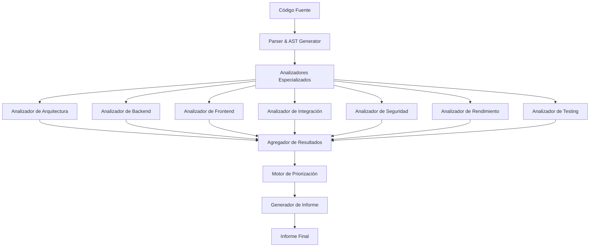

# Documento de Diseño: Sistema de Análisis de Arquitectura Full-Stack

## Overview

Este documento describe el diseño de un sistema automatizado de análisis y revisión arquitectónica para aplicaciones full-stack. El sistema está diseñado para analizar aplicaciones con stack tecnológico moderno (React + TypeScript en frontend, Node.js + Express + TypeScript en backend, MongoDB como base de datos) e identificar problemas de arquitectura, seguridad, rendimiento y mantenibilidad.

### Objetivos del Sistema

1. **Análisis Automatizado**: Escanear y analizar código fuente sin intervención manual
2. **Detección de Patrones**: Identificar patrones arquitectónicos y anti-patrones
3. **Evaluación de Calidad**: Calcular métricas cuantitativas de calidad de código
4. **Priorización Inteligente**: Ordenar mejoras por impacto vs esfuerzo
5. **Recomendaciones Accionables**: Proporcionar ejemplos concretos de código mejorado

### Alcance

El sistema analizará:
- Estructura de carpetas y organización de archivos
- Código fuente TypeScript/JavaScript (frontend y backend)
- Configuración de herramientas (ESLint, Prettier, Vite, Jest, Vitest)
- Dependencias y paquetes (package.json, package-lock.json)
- Documentación (README, comentarios en código)
- Tests existentes (unitarios, integración, property-based)
- Configuración de base de datos (modelos Mongoose, índices)
- Configuración de seguridad (CORS, headers, autenticación)

### Restricciones

- El análisis es estático (no ejecuta la aplicación)
- Requiere acceso de lectura al código fuente completo
- Las métricas de rendimiento son estimaciones basadas en análisis estático
- No puede detectar bugs lógicos complejos sin tests


## Arquitectura

El sistema sigue una arquitectura de pipeline de análisis con múltiples etapas:



### Flujo de Análisis

1. **Fase de Parsing**: 
   - Escaneo del sistema de archivos
   - Generación de AST (Abstract Syntax Tree) para archivos TypeScript/JavaScript
   - Extracción de metadatos de configuración

2. **Fase de Análisis**:
   - Ejecución paralela de analizadores especializados
   - Cada analizador produce hallazgos con severidad y categoría
   - Recolección de métricas cuantitativas

3. **Fase de Agregación**:
   - Consolidación de hallazgos de todos los analizadores
   - Eliminación de duplicados
   - Cálculo de puntuaciones por categoría

4. **Fase de Priorización**:
   - Aplicación de matriz impacto vs esfuerzo
   - Identificación de victorias rápidas
   - Generación de roadmap temporal

5. **Fase de Generación de Informe**:
   - Creación de resumen ejecutivo
   - Generación de ejemplos de código
   - Formateo de checklist de mejores prácticas


## Componentes y Interfaces

### 1. FileSystemScanner

**Responsabilidad**: Escanear el sistema de archivos y construir un mapa de la estructura del proyecto.

**Interfaz**:
```typescript
interface FileSystemScanner {
  scan(rootPath: string): Promise<ProjectStructure>;
  getFilesByPattern(pattern: string): Promise<string[]>;
  readFile(path: string): Promise<string>;
}

interface ProjectStructure {
  clientPath: string;
  serverPath: string;
  files: FileNode[];
  packageJsons: PackageJson[];
}

interface FileNode {
  path: string;
  type: 'file' | 'directory';
  extension?: string;
  size: number;
  children?: FileNode[];
}
```

### 2. ASTParser

**Responsabilidad**: Parsear archivos TypeScript/JavaScript y generar Abstract Syntax Trees.

**Interfaz**:
```typescript
interface ASTParser {
  parse(filePath: string, content: string): Promise<ParsedFile>;
  extractImports(ast: AST): Import[];
  extractExports(ast: AST): Export[];
  extractFunctions(ast: AST): FunctionDeclaration[];
  extractClasses(ast: AST): ClassDeclaration[];
}

interface ParsedFile {
  path: string;
  ast: AST;
  imports: Import[];
  exports: Export[];
  functions: FunctionDeclaration[];
  classes: ClassDeclaration[];
  complexity: number;
}
```

### 3. ArchitectureAnalyzer

**Responsabilidad**: Analizar patrones arquitectónicos y estructura general.

**Interfaz**:
```typescript
interface ArchitectureAnalyzer {
  analyze(project: ProjectStructure, parsedFiles: ParsedFile[]): Promise<ArchitectureFindings>;
  detectPatterns(): ArchitecturalPattern[];
  detectAntiPatterns(): AntiPattern[];
  evaluateLayering(): LayeringScore;
  analyzeCommunicationPatterns(): CommunicationPattern[];
}

interface ArchitectureFindings {
  patterns: ArchitecturalPattern[];
  antiPatterns: AntiPattern[];
  layeringScore: LayeringScore;
  communicationPatterns: CommunicationPattern[];
  issues: Finding[];
}
```

### 4. BackendAnalyzer

**Responsabilidad**: Analizar código del servidor y mejores prácticas de backend.

**Interfaz**:
```typescript
interface BackendAnalyzer {
  analyze(serverFiles: ParsedFile[]): Promise<BackendFindings>;
  analyzeErrorHandling(): ErrorHandlingFindings;
  analyzeValidation(): ValidationFindings;
  analyzeSecurity(): SecurityFindings;
  analyzeDatabaseQueries(): DatabaseFindings;
  analyzeLogging(): LoggingFindings;
}

interface BackendFindings {
  errorHandling: ErrorHandlingFindings;
  validation: ValidationFindings;
  security: SecurityFindings;
  database: DatabaseFindings;
  logging: LoggingFindings;
  issues: Finding[];
}
```

### 5. FrontendAnalyzer

**Responsabilidad**: Analizar código del cliente y mejores prácticas de React.

**Interfaz**:
```typescript
interface FrontendAnalyzer {
  analyze(clientFiles: ParsedFile[]): Promise<FrontendFindings>;
  analyzeComponents(): ComponentFindings;
  analyzeStateManagement(): StateFindings;
  analyzePerformance(): PerformanceFindings;
  analyzeAccessibility(): AccessibilityFindings;
  analyzeSecurity(): FrontendSecurityFindings;
}

interface FrontendFindings {
  components: ComponentFindings;
  state: StateFindings;
  performance: PerformanceFindings;
  accessibility: AccessibilityFindings;
  security: FrontendSecurityFindings;
  issues: Finding[];
}
```

### 6. IntegrationAnalyzer

**Responsabilidad**: Analizar la integración entre frontend y backend.

**Interfaz**:
```typescript
interface IntegrationAnalyzer {
  analyze(clientFiles: ParsedFile[], serverFiles: ParsedFile[]): Promise<IntegrationFindings>;
  analyzeAPIContracts(): APIContractFindings;
  analyzeTypeConsistency(): TypeConsistencyFindings;
  analyzeErrorHandlingConsistency(): ErrorConsistencyFindings;
  analyzeAuthFlow(): AuthFlowFindings;
}

interface IntegrationFindings {
  apiContracts: APIContractFindings;
  typeConsistency: TypeConsistencyFindings;
  errorConsistency: ErrorConsistencyFindings;
  authFlow: AuthFlowFindings;
  issues: Finding[];
}
```


### 7. SecurityAnalyzer

**Responsabilidad**: Identificar vulnerabilidades de seguridad.

**Interfaz**:
```typescript
interface SecurityAnalyzer {
  analyze(allFiles: ParsedFile[], dependencies: Dependency[]): Promise<SecurityFindings>;
  scanDependencies(): VulnerabilityReport[];
  analyzeAuthentication(): AuthSecurityFindings;
  analyzeAuthorization(): AuthzFindings;
  analyzeCORS(): CORSFindings;
  analyzeSecurityHeaders(): HeaderFindings;
  detectSensitiveDataExposure(): SensitiveDataFindings;
}

interface SecurityFindings {
  vulnerabilities: VulnerabilityReport[];
  authentication: AuthSecurityFindings;
  authorization: AuthzFindings;
  cors: CORSFindings;
  headers: HeaderFindings;
  sensitiveData: SensitiveDataFindings;
  criticalIssues: Finding[];
}
```

### 8. PerformanceAnalyzer

**Responsabilidad**: Identificar cuellos de botella de rendimiento.

**Interfaz**:
```typescript
interface PerformanceAnalyzer {
  analyze(allFiles: ParsedFile[]): Promise<PerformanceFindings>;
  analyzeBackendQueries(): QueryPerformanceFindings;
  analyzeFrontendBundle(): BundleFindings;
  analyzeAPICalls(): APICallFindings;
  analyzeCaching(): CachingFindings;
}

interface PerformanceFindings {
  queries: QueryPerformanceFindings;
  bundle: BundleFindings;
  apiCalls: APICallFindings;
  caching: CachingFindings;
  issues: Finding[];
}
```

### 9. TestingAnalyzer

**Responsabilidad**: Analizar cobertura y calidad de tests.

**Interfaz**:
```typescript
interface TestingAnalyzer {
  analyze(allFiles: ParsedFile[], testFiles: ParsedFile[]): Promise<TestingFindings>;
  calculateCoverage(): CoverageReport;
  analyzeTestQuality(): TestQualityFindings;
  identifyUntested(): UntestedCode[];
  analyzePropertyBasedTests(): PBTFindings;
}

interface TestingFindings {
  coverage: CoverageReport;
  quality: TestQualityFindings;
  untested: UntestedCode[];
  propertyBasedTests: PBTFindings;
  recommendations: TestRecommendation[];
}
```

### 10. PrioritizationEngine

**Responsabilidad**: Priorizar mejoras basándose en impacto y esfuerzo.

**Interfaz**:
```typescript
interface PrioritizationEngine {
  prioritize(findings: Finding[]): PrioritizedFindings;
  calculateImpact(finding: Finding): number;
  calculateEffort(finding: Finding): number;
  identifyQuickWins(findings: Finding[]): Finding[];
  generateRoadmap(findings: Finding[]): Roadmap;
}

interface PrioritizedFindings {
  critical: Finding[];
  high: Finding[];
  medium: Finding[];
  low: Finding[];
  quickWins: Finding[];
}

interface Roadmap {
  thirtyDays: Finding[];
  sixtyDays: Finding[];
  ninetyDays: Finding[];
}
```

### 11. ReportGenerator

**Responsabilidad**: Generar el informe final en formato markdown.

**Interfaz**:
```typescript
interface ReportGenerator {
  generate(allFindings: AllFindings, prioritized: PrioritizedFindings): Promise<Report>;
  generateExecutiveSummary(allFindings: AllFindings): string;
  generateCodeExamples(finding: Finding): CodeExample;
  generateChecklist(allFindings: AllFindings): Checklist;
  formatRoadmap(roadmap: Roadmap): string;
}

interface Report {
  executiveSummary: string;
  healthScore: number;
  criticalFindings: Finding[];
  prioritizedImprovements: Finding[];
  quickWins: Finding[];
  roadmap: Roadmap;
  codeExamples: CodeExample[];
  checklist: Checklist;
  fullMarkdown: string;
}
```


## Modelos de Datos

### Finding (Hallazgo)

Representa un problema, oportunidad de mejora o recomendación identificada durante el análisis.

```typescript
interface Finding {
  id: string;
  category: FindingCategory;
  severity: Severity;
  title: string;
  description: string;
  location: CodeLocation;
  impact: ImpactLevel;
  effort: EffortLevel;
  priority: number; // Calculado: impact / effort
  codeExample?: CodeExample;
  recommendation: string;
  references: string[]; // URLs a documentación
  requirementIds: string[]; // Referencias a requisitos
}

enum FindingCategory {
  ARCHITECTURE = 'architecture',
  BACKEND = 'backend',
  FRONTEND = 'frontend',
  INTEGRATION = 'integration',
  SECURITY = 'security',
  PERFORMANCE = 'performance',
  TESTING = 'testing',
  MAINTAINABILITY = 'maintainability',
  DEVELOPER_EXPERIENCE = 'developer-experience'
}

enum Severity {
  CRITICAL = 'critical',
  HIGH = 'high',
  MEDIUM = 'medium',
  LOW = 'low',
  INFO = 'info'
}

enum ImpactLevel {
  VERY_HIGH = 5,
  HIGH = 4,
  MEDIUM = 3,
  LOW = 2,
  VERY_LOW = 1
}

enum EffortLevel {
  VERY_LOW = 1,  // < 1 día
  LOW = 2,       // 1-3 días
  MEDIUM = 3,    // 1 semana
  HIGH = 4,      // 2-3 semanas
  VERY_HIGH = 5  // > 1 mes
}
```

### CodeLocation

Representa la ubicación de un hallazgo en el código fuente.

```typescript
interface CodeLocation {
  filePath: string;
  startLine: number;
  endLine: number;
  startColumn?: number;
  endColumn?: number;
  functionName?: string;
  className?: string;
}
```

### CodeExample

Representa un ejemplo de código antes/después para ilustrar una mejora.

```typescript
interface CodeExample {
  before: string;
  after: string;
  language: string;
  explanation: string;
  benefits: string[];
}
```

### Checklist

Representa una lista verificable de mejores prácticas.

```typescript
interface Checklist {
  categories: ChecklistCategory[];
  overallProgress: number; // Porcentaje 0-100
}

interface ChecklistCategory {
  name: string;
  items: ChecklistItem[];
  progress: number; // Porcentaje 0-100
}

interface ChecklistItem {
  id: string;
  description: string;
  status: ChecklistStatus;
  findingId?: string; // Referencia a Finding con detalles
  requirementId: string; // Referencia a requisito
}

enum ChecklistStatus {
  IMPLEMENTED = 'implemented',
  PARTIAL = 'partial',
  MISSING = 'missing',
  NOT_APPLICABLE = 'not-applicable'
}
```

### MetricsReport

Representa métricas cuantitativas del proyecto.

```typescript
interface MetricsReport {
  codeMetrics: CodeMetrics;
  testMetrics: TestMetrics;
  securityMetrics: SecurityMetrics;
  performanceMetrics: PerformanceMetrics;
}

interface CodeMetrics {
  totalFiles: number;
  totalLines: number;
  averageComplexity: number;
  duplicatedCodePercentage: number;
  maintainabilityIndex: number; // 0-100
  technicalDebtRatio: number; // Horas de deuda / Horas de desarrollo
}

interface TestMetrics {
  totalTests: number;
  unitTestCoverage: number; // Porcentaje
  integrationTestCoverage: number; // Porcentaje
  propertyBasedTests: number;
  testQualityScore: number; // 0-100
}

interface SecurityMetrics {
  vulnerabilitiesCount: number;
  criticalVulnerabilities: number;
  highVulnerabilities: number;
  securityScore: number; // 0-100
}

interface PerformanceMetrics {
  bundleSize: number; // KB
  estimatedLoadTime: number; // ms
  n1QueriesDetected: number;
  cachingScore: number; // 0-100
}
```

### HealthScore

Representa la puntuación general de salud del proyecto.

```typescript
interface HealthScore {
  overall: number; // 1-10
  breakdown: {
    architecture: number;
    backend: number;
    frontend: number;
    integration: number;
    security: number;
    performance: number;
    testing: number;
    maintainability: number;
    developerExperience: number;
  };
  trend?: 'improving' | 'stable' | 'declining';
  comparisonToBenchmark?: number; // Comparación con proyectos similares
}
```


## Propiedades de Corrección

*Una propiedad es una característica o comportamiento que debe mantenerse verdadero en todas las ejecuciones válidas de un sistema - esencialmente, una declaración formal sobre lo que el sistema debe hacer. Las propiedades sirven como puente entre especificaciones legibles por humanos y garantías de corrección verificables por máquina.*

### Propiedad 1: Escaneo completo de estructura

*Para cualquier* proyecto válido con carpetas /client y /server, el escaneo debe producir una ProjectStructure que contenga ambas rutas y todos los archivos TypeScript/JavaScript en el árbol de directorios.

**Valida: Requisitos 1.1**

### Propiedad 2: Detección de patrones de comunicación

*Para cualquier* proyecto que utilice fetch, axios, socket.io o GraphQL client, el análisis debe identificar correctamente el patrón de comunicación correspondiente (REST, WebSocket, GraphQL).

**Valida: Requisitos 1.2**

### Propiedad 3: Identificación de violaciones SRP

*Para cualquier* clase o función con múltiples responsabilidades (más de una razón para cambiar), el análisis debe identificarla como violación del principio de responsabilidad única.

**Valida: Requisitos 1.3**

### Propiedad 4: Consistencia de tipos frontend-backend

*Para cualquier* par de tipos TypeScript que representan el mismo concepto en frontend y backend, el análisis debe detectar discrepancias en nombres de propiedades, tipos de datos o estructura.

**Valida: Requisitos 1.4, 4.1**

### Propiedad 5: Generación de diagrama arquitectónico

*Para cualquier* proyecto analizado, el output debe contener un diagrama en formato Mermaid con nodos para componentes principales y aristas para relaciones entre ellos.

**Valida: Requisitos 1.5**

### Propiedad 6: Verificación de arquitectura en capas

*Para cualquier* estructura de backend, el análisis debe identificar si sigue el patrón de capas (controladores, servicios, repositorios) o reportar su ausencia.

**Valida: Requisitos 2.1**

### Propiedad 7: Detección de manejo de errores faltante

*Para cualquier* función asíncrona o que realiza operaciones de I/O sin try-catch o manejo de errores, el análisis debe identificarla como hallazgo.

**Valida: Requisitos 2.2**

### Propiedad 8: Detección de endpoints sin validación

*Para cualquier* endpoint de API que no utiliza middleware de validación (express-validator, Joi, Zod), el análisis debe reportarlo como hallazgo de seguridad.

**Valida: Requisitos 2.3**

### Propiedad 9: Verificación de elementos de seguridad backend

*Para cualquier* configuración de servidor Express, el análisis debe verificar la presencia de middleware de autenticación, configuración CORS, y headers de seguridad (helmet).

**Valida: Requisitos 2.4, 11.5, 11.6**

### Propiedad 10: Detección de problemas N+1

*Para cualquier* código que realiza consultas en un loop (for, map, forEach) sin usar populate, aggregate o joins, el análisis debe identificarlo como problema N+1.

**Valida: Requisitos 2.5, 6.1**

### Propiedad 11: Verificación de logging en operaciones críticas

*Para cualquier* operación crítica (autenticación, transacciones, operaciones de base de datos), el análisis debe verificar la presencia de statements de logging.

**Valida: Requisitos 2.6**

### Propiedad 12: Detección de valores hardcodeados

*Para cualquier* string literal que parece ser una URL, API key, password o configuración (contiene "http", "key", "secret", "password"), el análisis debe reportarlo como valor que debería ser variable de entorno.

**Valida: Requisitos 2.7, 11.2**

### Propiedad 13: Cálculo de cobertura de tests

*Para cualquier* proyecto con archivos de test, el análisis debe calcular el porcentaje de cobertura dividiendo líneas cubiertas entre líneas totales, separadamente para frontend y backend.

**Valida: Requisitos 2.8, 3.8, 12.1**

### Propiedad 14: Identificación de componentes grandes

*Para cualquier* componente React con más de 300 líneas o más de 5 hooks diferentes, el análisis debe identificarlo como componente que necesita refactorización.

**Valida: Requisitos 3.1**

### Propiedad 15: Evaluación de manejo de estado

*Para cualquier* componente que usa useState para datos que vienen del servidor, el análisis debe sugerir usar React Query, SWR o similar para estado de servidor.

**Valida: Requisitos 3.2**

### Propiedad 16: Detección de formularios sin validación

*Para cualquier* formulario (elemento form o componente con inputs) sin biblioteca de validación (react-hook-form, Formik, Yup), el análisis debe reportarlo.

**Valida: Requisitos 3.3**

### Propiedad 17: Verificación de error boundaries

*Para cualquier* aplicación React sin al menos un ErrorBoundary component, el análisis debe reportarlo como hallazgo de manejo de errores.

**Valida: Requisitos 3.4**

### Propiedad 18: Identificación de oportunidades de optimización

*Para cualquier* componente que renderiza listas sin React.memo, o componentes pesados sin lazy loading, el análisis debe sugerir optimizaciones específicas.

**Valida: Requisitos 3.5**

### Propiedad 19: Detección de vulnerabilidades XSS

*Para cualquier* uso de dangerouslySetInnerHTML o innerHTML sin sanitización (DOMPurify), el análisis debe reportarlo como vulnerabilidad crítica.

**Valida: Requisitos 3.6**

### Propiedad 20: Verificación de accesibilidad

*Para cualquier* elemento interactivo (button, input, link) sin atributos ARIA apropiados o sin manejo de teclado, el análisis debe reportarlo como problema de accesibilidad.

**Valida: Requisitos 3.7**

### Propiedad 21: Verificación de manejo de errores HTTP

*Para cualquier* llamada fetch/axios en el frontend, el análisis debe verificar que maneja códigos de error 4xx y 5xx que el backend puede retornar.

**Valida: Requisitos 4.2**

### Propiedad 22: Detección de validación duplicada

*Para cualquier* validación que existe tanto en frontend como en backend con la misma lógica, el análisis debe sugerirla como candidata para centralización.

**Valida: Requisitos 4.3**

### Propiedad 23: Verificación de versionado de API

*Para cualquier* API, el análisis debe verificar si las rutas incluyen versión (/api/v1/) o si existe estrategia de versionado documentada.

**Valida: Requisitos 4.4**

### Propiedad 24: Verificación de flujo de autenticación completo

*Para cualquier* implementación de autenticación, el análisis debe verificar la presencia de endpoints/funciones para login, logout, refresh token y verificación de token.

**Valida: Requisitos 4.5**

### Propiedad 25: Consistencia de paginación

*Para cualquier* endpoint que retorna listas paginadas, el análisis debe verificar que frontend y backend usan los mismos nombres de parámetros (page, limit, offset).

**Valida: Requisitos 4.6**

### Propiedad 26: Detección de nombres poco descriptivos

*Para cualquier* variable, función o clase con nombre de menos de 3 caracteres (excepto i, j, k en loops) o nombres genéricos (data, temp, foo), el análisis debe reportarlo.

**Valida: Requisitos 5.1**

### Propiedad 27: Detección de funciones complejas

*Para cualquier* función con más de 50 líneas o complejidad ciclomática mayor a 10, el análisis debe reportarla como candidata para refactorización.

**Valida: Requisitos 5.2**

### Propiedad 28: Verificación de documentación JSDoc

*Para cualquier* función exportada o método público sin comentario JSDoc, el análisis debe reportarlo como falta de documentación.

**Valida: Requisitos 5.3**

### Propiedad 29: Detección de código duplicado

*Para cualquier* par de bloques de código con más de 10 líneas idénticas o muy similares (>90% similitud), el análisis debe reportarlo como duplicación.

**Valida: Requisitos 5.4**

### Propiedad 30: Identificación de deuda técnica

*Para cualquier* archivo, el análisis debe encontrar todos los comentarios que contienen TODO, FIXME, HACK, XXX o DEBT y reportarlos con su ubicación.

**Valida: Requisitos 5.5**

### Propiedad 31: Cálculo de índice de mantenibilidad

*Para cualquier* módulo, el análisis debe calcular un índice de mantenibilidad (0-100) basado en complejidad ciclomática, líneas de código, y volumen de Halstead.

**Valida: Requisitos 5.6**

### Propiedad 32: Cálculo de tamaño de bundle

*Para cualquier* configuración de Vite/Webpack, el análisis debe calcular el tamaño estimado del bundle y sugerir code splitting si excede 500KB.

**Valida: Requisitos 6.2**

### Propiedad 33: Detección de llamadas API redundantes

*Para cualquier* componente que hace múltiples llamadas al mismo endpoint con los mismos parámetros, el análisis debe reportarlo como redundancia.

**Valida: Requisitos 6.3**

### Propiedad 34: Verificación de estrategias de caching

*Para cualquier* endpoint de API, el análisis debe verificar si usa headers de cache (Cache-Control, ETag) o implementa caching en memoria.

**Valida: Requisitos 6.4**

### Propiedad 35: Identificación de assets sin optimizar

*Para cualquier* imagen o asset referenciado, el análisis debe verificar su tamaño y formato, sugiriendo WebP o compresión si excede umbrales.

**Valida: Requisitos 6.5**

### Propiedad 36: Verificación de completitud del README

*Para cualquier* proyecto, el análisis debe verificar que el README contiene secciones esenciales: descripción, instalación, uso, configuración, y contribución.

**Valida: Requisitos 7.1**

### Propiedad 37: Verificación de scripts útiles

*Para cualquier* package.json, el análisis debe verificar la presencia de scripts comunes: dev, build, test, lint, format.

**Valida: Requisitos 7.2**

### Propiedad 38: Verificación de configuración de herramientas

*Para cualquier* proyecto, el análisis debe verificar la presencia de archivos .eslintrc, .prettierrc, y configuración de husky o lint-staged.

**Valida: Requisitos 7.3**

### Propiedad 39: Verificación de documentación de variables de entorno

*Para cualquier* proyecto que usa variables de entorno, el análisis debe verificar la presencia de archivo .env.example con todas las variables documentadas.

**Valida: Requisitos 7.4**

### Propiedad 40: Evaluación de calidad de commits

*Para cualquier* repositorio Git, el análisis debe verificar que los mensajes de commit siguen convenciones (conventional commits) y tienen descripciones significativas.

**Valida: Requisitos 7.5**

### Propiedad 41: Cálculo de puntuación de salud

*Para cualquier* conjunto de hallazgos agregados, el análisis debe calcular una puntuación de salud (1-10) usando una fórmula consistente basada en severidad y cantidad de hallazgos.

**Valida: Requisitos 8.1**

### Propiedad 42: Listado de hallazgos críticos

*Para cualquier* conjunto de hallazgos, todos los que tienen severidad CRITICAL deben aparecer en la sección de Hallazgos Críticos del informe.

**Valida: Requisitos 8.2**

### Propiedad 43: Priorización por impacto vs esfuerzo

*Para cualquier* conjunto de hallazgos, el top 10 debe estar ordenado por prioridad calculada como impacto / esfuerzo en orden descendente.

**Valida: Requisitos 8.3**

### Propiedad 44: Identificación de victorias rápidas

*Para cualquier* conjunto de hallazgos, las victorias rápidas deben ser aquellos con EffortLevel.VERY_LOW y ImpactLevel >= MEDIUM.

**Valida: Requisitos 8.4**

### Propiedad 45: Distribución temporal del roadmap

*Para cualquier* conjunto de hallazgos priorizados, el roadmap debe distribuirlos en 30/60/90 días basándose en esfuerzo acumulado y dependencias.

**Valida: Requisitos 8.5**

### Propiedad 46: Generación de ejemplos de código completos

*Para cualquier* hallazgo, el CodeExample debe contener código "before" extraído del proyecto, código "after" válido y sintácticamente correcto, y una explicación no vacía.

**Valida: Requisitos 9.1, 9.2, 9.3**

### Propiedad 47: Uso de código real en ejemplos

*Para cualquier* hallazgo con CodeLocation, el código "before" del ejemplo debe ser extraído del archivo real en esa ubicación.

**Valida: Requisitos 9.4**

### Propiedad 48: Inclusión de pasos de implementación

*Para cualquier* hallazgo de categoría MAINTAINABILITY o ARCHITECTURE, la recomendación debe incluir una lista numerada de pasos específicos para implementar la mejora.

**Valida: Requisitos 9.5**

### Propiedad 49: Completitud del checklist

*Para cualquier* análisis completo, el checklist debe contener categorías para: arquitectura, backend, frontend, integración, seguridad, rendimiento, testing, mantenibilidad y developer experience.

**Valida: Requisitos 10.1**

### Propiedad 50: Asignación de estado en checklist

*Para cualquier* ítem del checklist, debe tener exactamente uno de los estados: IMPLEMENTED, PARTIAL, MISSING, o NOT_APPLICABLE.

**Valida: Requisitos 10.2**

### Propiedad 51: Referencias en ítems faltantes

*Para cualquier* ChecklistItem con estado MISSING, debe existir un findingId que referencia un Finding con más detalles.

**Valida: Requisitos 10.3**

### Propiedad 52: Cálculo de progreso por categoría

*Para cualquier* ChecklistCategory, el progreso debe calcularse como (ítems IMPLEMENTED + 0.5 * ítems PARTIAL) / (total ítems - ítems NOT_APPLICABLE) * 100.

**Valida: Requisitos 10.4**

### Propiedad 53: Formato markdown del checklist

*Para cualquier* checklist generado, el output debe ser markdown válido con checkboxes (- [ ] o - [x]) y estructura jerárquica.

**Valida: Requisitos 10.5**

### Propiedad 54: Detección de dependencias vulnerables

*Para cualquier* package.json, el análisis debe consultar bases de datos de vulnerabilidades (npm audit, Snyk) e identificar paquetes con CVEs conocidos.

**Valida: Requisitos 11.1**

### Propiedad 55: Verificación de endpoints sin autenticación

*Para cualquier* ruta de Express que no usa middleware de autenticación (excepto rutas públicas como /health, /login), el análisis debe reportarlo como hallazgo de seguridad.

**Valida: Requisitos 11.3**

### Propiedad 56: Detección de logging de datos sensibles

*Para cualquier* statement de logging (console.log, logger.info) que incluye variables con nombres como "password", "token", "secret", "key", el análisis debe reportarlo como hallazgo crítico.

**Valida: Requisitos 11.4**

### Propiedad 57: Detección de configuración CORS permisiva

*Para cualquier* configuración CORS con origin: "*" o credentials: true con origin: "*", el análisis debe reportarlo como hallazgo de seguridad.

**Valida: Requisitos 11.6**

### Propiedad 58: Severidad crítica para inyecciones

*Para cualquier* hallazgo que involucra concatenación de strings en consultas SQL/NoSQL sin parametrización, debe asignarse severidad CRITICAL.

**Valida: Requisitos 11.7**

### Propiedad 59: Identificación de funciones críticas sin tests

*Para cualquier* función con complejidad ciclomática > 5 o que maneja errores/seguridad sin archivo de test correspondiente, el análisis debe reportarlo.

**Valida: Requisitos 12.2**

### Propiedad 60: Verificación de tests de integración

*Para cualquier* flujo principal identificado (rutas de autenticación, operaciones CRUD principales), el análisis debe verificar la existencia de tests de integración end-to-end.

**Valida: Requisitos 12.3**

### Propiedad 61: Verificación de property-based tests

*Para cualquier* función con lógica compleja (parsers, validadores, transformadores), el análisis debe verificar si tiene property-based tests usando fast-check.

**Valida: Requisitos 12.4**

### Propiedad 62: Detección de tests sin assertions

*Para cualquier* función de test (describe, it, test) que no contiene expect, assert, o should, el análisis debe reportarlo como test de baja calidad.

**Valida: Requisitos 12.5**

### Propiedad 63: Priorización de áreas para testing

*Para cualquier* conjunto de funciones sin tests, el análisis debe priorizarlas multiplicando complejidad * criticidad y ordenar por este score.

**Valida: Requisitos 12.6**


## Manejo de Errores

### Estrategia General

El sistema de análisis debe ser robusto ante errores en el código analizado. Los errores no deben detener el análisis completo, sino reportarse como hallazgos adicionales.

### Tipos de Errores

1. **Errores de Parsing**
   - Archivos con sintaxis inválida
   - Archivos TypeScript con errores de tipo
   - Manejo: Reportar como hallazgo CRITICAL, continuar con otros archivos

2. **Errores de Acceso a Archivos**
   - Permisos insuficientes
   - Archivos no encontrados
   - Manejo: Loguear warning, excluir archivo del análisis

3. **Errores de Análisis**
   - Patrones no reconocidos
   - Estructuras inesperadas
   - Manejo: Loguear info, marcar como "análisis parcial"

4. **Errores de Dependencias Externas**
   - API de vulnerabilidades no disponible
   - Timeout en consultas externas
   - Manejo: Usar cache si disponible, reportar limitación en informe

### Recuperación y Degradación Graciosa

```typescript
interface AnalysisResult {
  findings: Finding[];
  errors: AnalysisError[];
  warnings: AnalysisWarning[];
  partialAnalysis: boolean;
  completedAnalyzers: string[];
  failedAnalyzers: string[];
}

interface AnalysisError {
  analyzer: string;
  message: string;
  file?: string;
  severity: 'fatal' | 'error' | 'warning';
  recoverable: boolean;
}
```

### Validación de Entrada

- Verificar que el directorio raíz existe y es accesible
- Verificar que contiene package.json
- Verificar estructura mínima (al menos /client o /server)
- Proporcionar mensajes de error claros si la validación falla

### Logging

- Nivel DEBUG: Detalles de cada analizador
- Nivel INFO: Progreso general del análisis
- Nivel WARN: Problemas no críticos (archivos omitidos)
- Nivel ERROR: Errores que afectan resultados
- Nivel FATAL: Errores que impiden completar el análisis


## Estrategia de Testing

### Enfoque Dual: Tests Unitarios y Property-Based Tests

El sistema requiere tanto tests unitarios como property-based tests para garantizar corrección completa:

- **Tests unitarios**: Verifican ejemplos específicos, casos edge y condiciones de error
- **Property-based tests**: Verifican propiedades universales a través de muchos inputs generados

Ambos tipos son complementarios y necesarios para cobertura comprehensiva.

### Configuración de Property-Based Testing

**Biblioteca**: fast-check (para TypeScript/JavaScript)

**Configuración mínima**:
- 100 iteraciones por test (debido a randomización)
- Cada test debe referenciar su propiedad del documento de diseño
- Formato de tag: `// Feature: full-stack-architecture-review, Property N: [texto de propiedad]`

### Tests Unitarios

**Áreas de enfoque**:

1. **Parsing y AST**
   - Ejemplo: Parsear archivo TypeScript válido produce AST correcto
   - Ejemplo: Parsear archivo con sintaxis inválida retorna error descriptivo
   - Edge case: Archivos vacíos, archivos muy grandes

2. **Analizadores Individuales**
   - Ejemplo: BackendAnalyzer detecta endpoint sin try-catch
   - Ejemplo: FrontendAnalyzer identifica componente de 500 líneas
   - Edge case: Archivos sin código, solo comentarios

3. **Motor de Priorización**
   - Ejemplo: Hallazgo con impact=5, effort=1 tiene prioridad 5
   - Ejemplo: Victoria rápida tiene effort=VERY_LOW e impact>=MEDIUM
   - Edge case: Todos los hallazgos tienen misma prioridad

4. **Generador de Informe**
   - Ejemplo: Informe contiene todas las secciones requeridas
   - Ejemplo: Markdown generado es válido
   - Edge case: Cero hallazgos, informe vacío

### Property-Based Tests

**Cada propiedad del diseño debe tener un test correspondiente**:

```typescript
// Feature: full-stack-architecture-review, Property 1: Escaneo completo de estructura
test('Property 1: Scanning produces complete structure', () => {
  fc.assert(
    fc.property(
      projectGenerator(), // Genera proyectos válidos aleatorios
      async (project) => {
        const scanner = new FileSystemScanner();
        const structure = await scanner.scan(project.rootPath);
        
        // Verificar que contiene ambas rutas
        expect(structure.clientPath).toBeDefined();
        expect(structure.serverPath).toBeDefined();
        
        // Verificar que todos los archivos TS/JS están incluidos
        const allTsJsFiles = getAllTsJsFiles(project.rootPath);
        const scannedFiles = structure.files.flatMap(getLeafFiles);
        expect(scannedFiles.length).toBe(allTsJsFiles.length);
      }
    ),
    { numRuns: 100 }
  );
});

// Feature: full-stack-architecture-review, Property 43: Priorización por impacto vs esfuerzo
test('Property 43: Top 10 ordered by priority', () => {
  fc.assert(
    fc.property(
      fc.array(findingGenerator(), { minLength: 10, maxLength: 100 }),
      (findings) => {
        const engine = new PrioritizationEngine();
        const prioritized = engine.prioritize(findings);
        
        // Verificar que top 10 está ordenado por prioridad descendente
        const top10 = prioritized.high.slice(0, 10);
        for (let i = 0; i < top10.length - 1; i++) {
          expect(top10[i].priority).toBeGreaterThanOrEqual(top10[i + 1].priority);
        }
      }
    ),
    { numRuns: 100 }
  );
});
```

### Generadores para Property-Based Tests

**Generadores necesarios**:

```typescript
// Genera proyectos válidos con estructura aleatoria
const projectGenerator = (): fc.Arbitrary<Project> => {
  return fc.record({
    rootPath: fc.string(),
    clientFiles: fc.array(fileGenerator()),
    serverFiles: fc.array(fileGenerator()),
    packageJson: packageJsonGenerator()
  });
};

// Genera archivos TypeScript válidos
const fileGenerator = (): fc.Arbitrary<FileContent> => {
  return fc.record({
    path: fc.string(),
    content: fc.oneof(
      validTypeScriptGenerator(),
      invalidTypeScriptGenerator()
    )
  });
};

// Genera hallazgos con propiedades aleatorias
const findingGenerator = (): fc.Arbitrary<Finding> => {
  return fc.record({
    id: fc.uuid(),
    category: fc.constantFrom(...Object.values(FindingCategory)),
    severity: fc.constantFrom(...Object.values(Severity)),
    impact: fc.integer({ min: 1, max: 5 }),
    effort: fc.integer({ min: 1, max: 5 }),
    // ... otros campos
  });
};
```

### Tests de Integración

**Flujos end-to-end**:

1. **Análisis completo de proyecto de ejemplo**
   - Input: Proyecto de ejemplo con problemas conocidos
   - Output: Informe que identifica todos los problemas esperados
   - Verificación: Todos los hallazgos críticos esperados están presentes

2. **Análisis de proyecto limpio**
   - Input: Proyecto que sigue todas las mejores prácticas
   - Output: Informe con puntuación alta (>8/10)
   - Verificación: Cero hallazgos críticos, pocos hallazgos de severidad alta

3. **Análisis incremental**
   - Input: Proyecto, luego proyecto mejorado
   - Output: Segunda puntuación mayor que primera
   - Verificación: Hallazgos disminuyen, puntuación aumenta

### Cobertura Objetivo

- **Cobertura de líneas**: >80% para código de análisis
- **Cobertura de branches**: >75% para lógica de decisión
- **Cobertura de funciones**: >90% para funciones públicas
- **Property tests**: 100% de propiedades del diseño implementadas

### Estrategia de Mocking

**Mocks necesarios**:
- Sistema de archivos (para tests unitarios rápidos)
- APIs externas (vulnerabilidades, npm registry)
- Git (para análisis de commits)

**No mockear**:
- Parsers (usar archivos reales pequeños)
- Lógica de análisis (probar con código real)

### CI/CD

- Ejecutar todos los tests en cada PR
- Ejecutar property tests con más iteraciones (1000) en nightly builds
- Generar reporte de cobertura y fallar si baja del umbral
- Ejecutar tests de integración en ambiente aislado

