# Gestión del Estado: Contexto y Zustand

Streamlyra utiliza una arquitectura híbrida para la gestión del estado, eligiendo la herramienta adecuada según el tipo de datos y la frecuencia de actualización.

## AuthProvider (React Context)

El `AuthProvider` gestiona la identidad y sesión del usuario. Dado que los datos de autenticación cambian poco frecuentemente, React Context es ideal por su simplicidad. Utiliza `localStorage` para persistir la sesión.

### Funcionalidades principales

- **Persistencia**: Mantiene al usuario conectado entre recargas de página.
- **Validación**: Verifica la validez del token con el servidor al iniciar la aplicación.
- **Hook: `useAuth`**: Provee acceso a `user`, `status`, `isAuthenticated` y funciones de `login`/`logout`.
- **Integración con Sockets**: Al cerrar sesión, emite un evento `logout` al servidor para limpiar recursos inmediatamente (omitir periodo de gracia).

---

## Arquitectura de Flujo de Datos

El siguiente diagrama ilustra cómo fluyen los datos desde el servidor hasta los componentes de la interfaz, pasando por los mecanismos de sincronización y los stores de estado global.

```mermaid
graph TD
    subgraph Servidor [Backend]
        API[API REST /me]
        WS[Socket.io Server]
    end

    subgraph Sync [Capa de Sincronización]
        useSocket[Hook useSocket]
        useAuthHook[Hook useAuth]
    end

    subgraph GlobalState [Gestión de Estado]
        AuthCtx[AuthProvider - Context]
        ConnStore[useConnectionsStore - Zustand]
        ChatStore[useChatStore - Zustand]
    end

    subgraph UI [Componentes React]
        Sidebar[Sidebar / Stats]
        Feed[ChatFeed / Messages]
        Profile[User Menu / Auth]
    end

    %% Flujos de Identidad
    API -->|1. Validación| useAuthHook
    useAuthHook -->|2. Identidad| AuthCtx
    AuthCtx -->|3. Sesión Fija| Profile

    %% Flujos de Conexiones
    API -->|1. Carga Inicial| ConnStore
    WS -->|2. Eventos Real-time| useSocket
    useSocket -->|3. Actualización Atómica| ConnStore
    ConnStore -->|4. Re-renders Quirúrgicos| Sidebar

    %% Flujos de Chat
    WS -->|2. Mensajes Crudos| useSocket
    useSocket -->|3. Batching & Cleaning| ChatStore
    ChatStore -->|4. Feed Optimizado| Feed

    style GlobalState fill:#1a1a1a,stroke:#7c3aed,stroke-width:2px
    style Sync fill:#1a1a1a,stroke:#3b82f6,stroke-width:2px
    style Servidor fill:#1a1a1a,stroke:#ef4444,stroke-width:2px
```

---

## Zustand Stores (Alta Frecuencia)

Para datos en tiempo real y componentes que requieren actualizaciones rápidas sin re-renders masivos, hemos migrado a **Zustand**. Estos son los archivos centrales:

### 1. `src/store/useConnectionsStore.ts`

Es el orquestador del estado de las plataformas conectadas.

- **Estado Atómico**: Almacena un mapa de `connectionsStatus` y `connectionsStats` indexados por plataforma.
- **Selectores Memorizados**: Los componentes usan `useShallow` y selectores granulares para escuchar cambios solo en las propiedades que necesitan (ej: solo el conteo de espectadores de Twitch).
- **Consistencia de Datos**: Al recibir datos de la API (polling), el store mezcla la información con los eventos de tiempo real del Socket, priorizando los estados transitorios (como `searching`) para evitar que la UI retroceda a estados "Offline" erróneamente.
- **Hash de Conexión**: Mantiene un `connectionHash` calculado que permite a hooks como `useSocket` reaccionar a cambios estructurales en las conexiones sin depender de la referencia del objeto.

### 2. `src/store/useChatStore.ts`

Gestiona la memoria y el flujo de mensajes simultáneos con alto rendimiento.

- **Mecanismo de Flush/Batching**: Los mensajes se acumulan en un buffer temporal y se "vuelcan" al estado principal cada 300ms. Esto previene que el hilo principal se bloquee durante ráfagas intensas de chat.
- **Acciones de Moderación Global**: Permite eliminar mensajes o banear usuarios de forma atómica. Al eliminar un mensaje en el store, todos los componentes suscritos reflejan el cambio instantáneamente.
- **Optimización de Memoria (MAX_MESSAGES)**: Implementa una limpieza automática (trimming) para mantener el arreglo de mensajes dentro de un límite (ej. 1000 mensajes), evitando fugas de memoria en sesiones largas.
- **Hook `useChatMessages`**: Recientemente refactorizado de un manejador de estado independiente de React a un "thin proxy" que encapsula llamadas a `useChatStore` usando `useShallow`. Mantiene compatibilidad hacia atrás en los componentes antiguos, pero se orienta íntegramente al rendimiento centralizado de Zustand.

---

## Beneficios de la Arquitectura con Zustand

1.  **Rendimiento Extremo**: Eliminación del "Context Hell". Un mensaje de chat ya no provoca que se refresque la barra de herramientas o el buscador.
2.  **Lógica Desacoplada**: Los hooks como `useConnectionsSocket` envían datos directamente a los stores sin necesidad de pasar por la pirámide de componentes de React.
3.  **Estado Predictible**: Al centralizar la lógica en stores puramente de TypeScript, el comportamiento ante errores y estados complejos es más fácil de depurar.

---

## DialogProvider (lib/dialog)

Provee una interfaz imperativa para mostrar diálogos de confirmación en toda la aplicación mediante `dialogService`, evitando la necesidad de declarar estados "open/close" en cada página.

ElSantana
