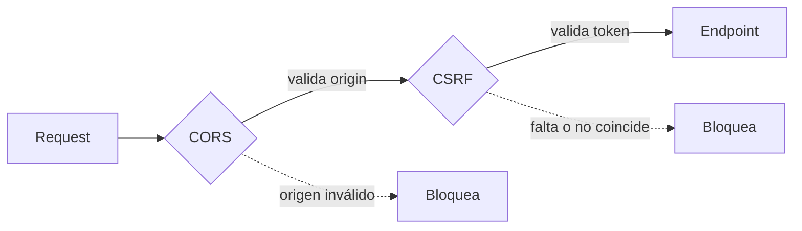

# Middlewares: Documentación Completa

Los middlewares son la **primera línea de defensa** de Streamlyra. Toda petición HTTP pasa por ellos antes de llegar a cualquier controlador. El servidor tiene dos grupos: los middlewares generales y los de validación de webhooks (uno por plataforma).

## Middlewares Generales (`src/middleware/`)

### `auth.middleware.ts`

Valida la sesión del usuario mediante **JWT almacenado en cookie**.

Exporta dos funciones con distintos niveles de exigencia:

| Función                | Comportamiento                                                                                     |
| ---------------------- | -------------------------------------------------------------------------------------------------- |
| `authenticateToken`    | Requiere sesión activa. Rechaza con 401 si no hay token o con 403 si está expirado                 |
| `optionalAuthenticate` | Intenta leer el token. Si no lo encuentra o está expirado, **continúa de todas formas** sin fallar |

**Detalles técnicos**:

- Busca el token en dos sitios: primero en la cookie `auth_token`, luego en el header `Authorization: Bearer <token>`.
- Valida que el payload decodificado tenga exactamente `{ id: string, username: string }`. Si tiene otra forma, rechaza con 403 para evitar tokens con estructura arbitraria.
- En caso de `TokenExpiredError`, devuelve un mensaje explícito al usuario para que sepa que debe volver a iniciar sesión.

### `csrf.middleware.ts`

Protección contra **ataques Cross-Site Request Forgery**.

**Lógica de Exclusión Centralizada (`isPathExcluded`)**:
Se utiliza una lógica unificada para determinar qué rutas no requieren CSRF (Webhooks y login inicial de Twitch/YouTube). Cualquier otra ruta mutante (POST/PUT/DELETE) está protegida por defecto.

**Exporta dos middlewares:**

1. **`setCsrfCookie`**: Genera y establece el token CSRF
   - Genera un token aleatorio de 32 bytes si no existe.
   - Lo almacena en una cookie `csrf_token` (no-HttpOnly para permitir lectura en same-origin).
   - **Expone el token en el header de respuesta `X-CSRF-Token`** para asegurar que el cliente reciba el token en la primera llamada segura (`GET /api/auth/me`).
   - Se ejecuta en todas las peticiones excepto las definidas en `isPathExcluded`.

2. **`verifyCsrf`**: Valida el token en peticiones mutables
   - **Doble Token**: Compara la cookie `csrf_token` con el header `X-CSRF-Token` enviado por el cliente.
   - **Comparación Temporal Constante**: Usa `crypto.timingSafeEqual` para prevenir timing attacks.
   - **Exclusiones automáticas**: 
     - Métodos seguros (`GET`, `HEAD`, `OPTIONS`) no requieren validación.
     - Rutas según `isPathExcluded` (Webhooks).
     - **IMPORTANTE**: Rutas críticas como `/api/auth/logout` y `/api/auth/platform` (desconexión) **SÍ** requieren validación CSRF para prevenir desconexiones no autorizadas.
     - Peticiones sin autenticación no requieren CSRF (solo valida si existe cookie `auth_token`).

**Soporte Cross-Origin:**
El middleware está diseñado para funcionar tanto en entornos same-origin como cross-origin:
- **Same-origin**: El cliente lee el token de la cookie y lo envía en el header
- **Cross-origin**: El cliente lee el token del header de respuesta, lo almacena en memoria y lo envía en peticiones subsecuentes

**Capas de protección:**


### `zod.middleware.ts`

Validación y **sanitización de datos** de entrada.

- Exporta `validateZodBody(schema)`, una función de orden superior que recibe un esquema Zod y devuelve un middleware.
- Si la validación **falla**: devuelve un error 400 con un mensaje legible para humanos en español (ej. `"email es requerido"`, `"message: String must contain at least 1 character"`).
- Si la validación **pasa**: reemplaza `req.body` con los datos ya parseados y tipados por Zod. Esto elimina cualquier campo extra no esperado.

### `rateLimit.middleware.ts`

Control de tasa de peticiones para **prevenir abuso y ataques de fuerza bruta**.

Exporta tres limitadores configurados independientemente:

| Limitador        | Límite                  | Aplica a                                                   |
| ---------------- | ----------------------- | ---------------------------------------------------------- |
| `apiLimiter`     | 100 req / 15 min por IP | Rutas generales de la API (excluye auth y webhooks)        |
| `authLimiter`    | 20 req / 15 min por IP  | Todas las rutas de `/api/auth` (incluyendo logout/platform) |
| `webhookLimiter` | 600 req / 1 min por IP  | Solo `/api/webhooks` (ráfagas de Twitch/Kick son normales) |

> **Importante**: En entorno `test` (`NODE_ENV=test`), todos los limitadores se deshabilitan automáticamente para no interferir con los tests.

## Middlewares de Webhooks (`src/middleware/webhooks/`)

### `utils.ts` — Utilidades Compartidas

Contiene tipos e helpers usados por los tres middlewares de webhooks:

- **`RequestWithWebhookData`**: Extiende el `Request` de Express para transportar los datos del webhook ya validados hacia el controlador.
- **`extractHeader(req, names[])`**: Busca un header probando varios nombres posibles (útil porque Kick, por ejemplo, puede enviar `Kick-Event-Signature` o `X-Kick-Signature`).
- **`validateTimestamp(timestamp)`**: Previene **Replay Attacks** rechazando mensajes con más de **5 minutos** de antigüedad (estándar de industria recomendado por Twitch). También registra un aviso si el desfase es mayor a 1 minuto (Clock Skew).

### `twitch.middleware.ts` — Validación de EventSub

El proceso de validación al recibir un evento de Twitch es:

```
1. Verificar que existan los 4 headers obligatorios:
   - Twitch-Eventsub-Message-Id
   - Twitch-Eventsub-Message-Timestamp
   - Twitch-Eventsub-Message-Signature
   - Twitch-Eventsub-Message-Type

2. Validar antigüedad del timestamp (≤ 10 min)

3. Extraer broadcaster_id del payload

4. Buscar el webhook en la BD por subscriptionId o broadcasterId

5. Desencriptar el secreto almacenado (AES-256-GCM)
   └─ Si el secreto no está encriptado aún → auto-migrarlo en background

6. Calcular y comparar firma HMAC-SHA256:
   HMAC(secret, messageId + timestamp + rawBody)

7. Verificar si el mensaje ya fue procesado (deduplicación)

8. Manejar tipos de mensaje especiales:
   - webhook_callback_verification → Responder con `hub.challenge`
   - revocation → Marcar suscripción como revocada en BD

9. Si todo pasó → adjuntar datos en req.webhookData y llamar next()
```

### `youtube.middleware.ts` — Validación de PubSubHubbub

Maneja **dos métodos HTTP** porque YouTube PubSub funciona diferente a Twitch:

**GET (Verificación de suscripción)**:

1. YouTube envía `hub.mode`, `hub.topic`, `hub.challenge`.
2. El middleware extrae el `channelId` del topic URL.
3. Verifica que tengamos esa suscripción registrada en la BD.
4. Desencripta el secreto (+ auto-migración si es necesario).
5. Responde con el `hub.challenge` en texto plano para confirmar la suscripción.

**POST (Notificación de evento)**:

1. Lee el `X-Hub-Signature` del header.
2. Parsea el XML del cuerpo para extraer el `channelId` (`<yt:channelId>`).
3. Busca la suscripción con estado `verified` en la BD.
4. Desencripta el secreto.
5. Calcula y compara la firma HMAC-SHA1 del body.
6. Actualiza el timestamp de última notificación (en background, sin bloquear la respuesta).
7. Adjunta `{ channelId, body }` en `req.youtubeWebhookData` y llama a `next()`.

### `kick.middleware.ts` — Validación de Webhooks de Kick

Kick tiene su propia particularidad: usa **nombres de headers alternativos** según la versión de su API.

```
Headers que acepta (probados en orden):
- Kick-Event-Signature  ó  X-Kick-Signature  ó  kick-event-signature
- Kick-Event-Message-Timestamp  ó  X-Kick-Timestamp  ó  ...
- Kick-Event-Message-Id  ó  X-Kick-Event-Message-Id  ó  ...
- Kick-Event-Type  ó  X-Kick-Event-Type  ó  ...
```

**Caso especial — Challenge**: Si Kick envía `body.challenge` o el evento es de tipo `webhook.callback_verification`, el middleware devuelve el challenge inmediatamente (sin validar firma) para completar el registro del webhook.

**Validación normal**:

1. Extrae y valida los headers (probando los nombres alternativos).
2. Valida el timestamp (≤ 10 min).
3. Verifica que `rawBody` esté disponible (requerido para calcular la firma).
4. Calcula HMAC con la clave pública de Kick y valida la firma.
5. Verifica si el mensaje ya fue procesado (deduplicación).
6. Si todo pasa → adjunta datos en `req.webhookData` y llama a `next()`.

> **Nota**: Existe un flag de configuración `skipKickSignatureVerification` para entornos de desarrollo donde sea difícil replicar las firmas de Kick localmente.