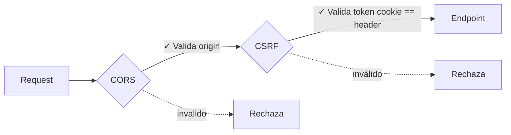

# Seguridad y Protección de Datos

Streamlyra implementa múltiples capas de seguridad para proteger tanto la información de los usuarios como la integridad de las peticiones que recibe el servidor.

## Protección de Datos Sensibles (AES-256-GCM)

Utilizamos el algoritmo **AES-256-GCM** para encriptar información sensible antes de guardarla en la base de datos (como tokens de acceso de Twitch o YouTube).

- **EncryptionService**: Ubicado en `src/services/security/EncryptionService.ts`.
- **IV & Auth Tag**: Cada encriptación genera un Vector de Inicialización (IV) y un Tag de Autenticación únicos, asegurando que el mismo texto no produzca el mismo resultado cifrado.
- **Formato**: Los datos se guardan como `iv:authTag:encryptedText`.

## Autenticación (JWT & Cookies)

La sesión del usuario se gestiona mediante tokens **JWT (JSON Web Tokens)** almacenados en cookies seguras.

- **Seguridad de Cookies**: Configuradas como `HttpOnly` para prevenir ataques de Cross-Site Scripting (XSS).
- **Expiración**: Los tokens tienen una vida útil definida para limitar el impacto en caso de robo.

## Protección CSRF (Cross-Site Request Forgery)

Implementamos un sistema de **doble cookie/header** para validar peticiones mutables (`POST`, `PUT`, `DELETE`):

1. El servidor envía un `csrf_token` en una cookie **no-HttpOnly** (para que el cliente pueda leerla).
2. El cliente debe reenviar este token en el header `X-CSRF-Token`.
3. El servidor compara ambos valores utilizando `crypto.timingSafeEqual` para prevenir ataques de temporización.

**Capas de seguridad activas:**

**Protecciones implementadas:**

- **CORS** valida que las requests vengan del frontend autorizado
- **CSRF** valida que el token cookie coincida con el header
- **Timing-safe comparison** previene timing attacks
- **SameSite cookies** previenen CSRF básico
- **Rate limiting** previene brute force

**Exclusiones:**
- Métodos seguros (`GET`, `HEAD`, `OPTIONS`) no requieren CSRF
- Webhooks (`/api/webhooks`) están excluidos (validados por firmas HMAC)
- Peticiones sin autenticación no requieren CSRF

> [!NOTE]
> Los webhooks (como `/api/webhooks`) están excluidos de la validación CSRF ya que provienen de servidores externos confiables y se validan mediante firmas criptográficas propias de la plataforma (ej. firmas HMAC de Twitch).

## Rate Limiting

Para prevenir ataques de fuerza bruta y denegación de servicio (DoS):

- **API General**: Límites estándar para la mayoría de los endpoints.
- **Auth & Webhooks**: Límites más estrictos en rutas críticas de inicio de sesión y recepción de datos.

## Validación de Esquemas (Zod)

Todas las entradas de la API se validan antes de llegar a la lógica de negocio usando **Zod**. Si un cliente envía datos malformados o sospechosos, el servidor responde automáticamente con un error `400 Bad Request`, evitando procesar entradas no confiables.