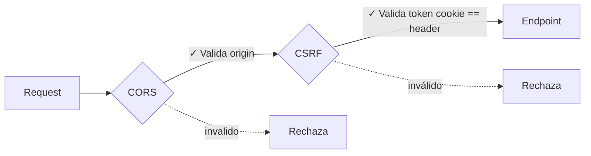

# Seguridad y Protección de Datos

Streamlyra implementa múltiples capas de seguridad para proteger tanto la información de los usuarios como la integridad de las peticiones que recibe el servidor.

## Protección de Datos Sensibles (AES-256-GCM)

Utilizamos el algoritmo **AES-256-GCM** para encriptar información sensible antes de guardarla en la base de datos (como tokens de acceso de Twitch o YouTube).

- **EncryptionService**: Ubicado en `src/services/security/EncryptionService.ts`.
- **IV & Auth Tag**: Cada encriptación genera un Vector de Inicialización (IV) y un Tag de Autenticación únicos, asegurando que el mismo texto no produzca el mismo resultado cifrado.
- **Formato**: Los datos se guardan como `iv:authTag:encryptedText`.

## Autenticación (JWT & Cookies)

La sesión del usuario se gestiona mediante tokens **JWT (JSON Web Tokens)** almacenados en cookies seguras.

- **Seguridad de Cookies**: Configuradas como `HttpOnly` para prevenir ataques de Cross-Site Scripting (XSS).
- **Expiración**: Los tokens tienen una vida útil definida para limitar el impacto en caso de robo.

## Protección CSRF (Cross-Site Request Forgery)

Implementamos un sistema de **doble cookie/header** para validar peticiones mutables (`POST`, `PUT`, `DELETE`):

1. El servidor genera un token CSRF aleatorio de 32 bytes
2. El servidor envía el token de dos formas:
   - En una cookie `csrf_token` (no-HttpOnly para lectura en same-origin)
   - En el header de respuesta `X-CSRF-Token` (para clientes cross-origin)
3. El cliente almacena el token (en memoria para cross-origin, o lee de cookie en same-origin)
4. El cliente reenvía el token en el header `X-CSRF-Token` en peticiones mutables
5. El servidor compara ambos valores (cookie vs header) utilizando `crypto.timingSafeEqual` para prevenir timing attacks

**Soporte Cross-Origin:**
Esta implementación funciona tanto en entornos same-origin como cross-origin (ej. frontend en Vercel, backend en Render):
- En **same-origin**: El cliente puede leer la cookie directamente
- En **cross-origin**: El cliente lee el token del header `X-CSRF-Token` expuesto por CORS y lo almacena en memoria

**Capas de seguridad activas:**

**Protecciones implementadas:**

- **CORS** valida que las requests vengan del frontend autorizado
- **CSRF** valida que el token cookie coincida con el header
- **Timing-safe comparison** previene timing attacks
- **SameSite cookies** previenen CSRF básico
- **Rate limiting** previene brute force

**Exclusiones:**
- Métodos seguros (`GET`, `HEAD`, `OPTIONS`) no requieren CSRF.
- Webhooks (`/api/webhooks`) están excluidos (validados por firmas HMAC).
- Peticiones sin autenticación (`!!getCookie(req, 'auth_token') === false`) no requieren CSRF por diseño del middleware.
- **Ruta de Login**: `/api/auth/twitch`, `/api/auth/youtube`, etc., están excluidas temporalmente para permitir el establecimiento inicial de la cookie tras el flujo OAuth.

**Protección de Propiedad de Conexión (Anti-Stealing)**:
El sistema valida que una cuenta de plataforma no sea vinculada a un usuario si ya pertenece a otro. 
- Si un usuario logueado intenta vincular una red social reclamada, el servidor rechaza con `409 Conflict`.
- Esto previene el robo accidental o malicioso de integraciones entre usuarios.

> [!NOTE]
> Los webhooks (como `/api/webhooks`) están excluidos de la validación CSRF ya que provienen de servidores externos confiables y se validan mediante firmas criptográficas propias de la plataforma (ej. firmas HMAC de Twitch).

## Rate Limiting

Para prevenir ataques de fuerza bruta y denegación de servicio (DoS):

- **API General**: Límites estándar para la mayoría de los endpoints.
- **Auth & Webhooks**: Límites más estrictos en rutas críticas de inicio de sesión y recepción de datos.

## Validación de Esquemas (Zod)

Todas las entradas de la API se validan antes de llegar a la lógica de negocio usando **Zod**. Si un cliente envía datos malformados o sospechosos, el servidor responde automáticamente con un error `400 Bad Request`, evitando procesar entradas no confiables.